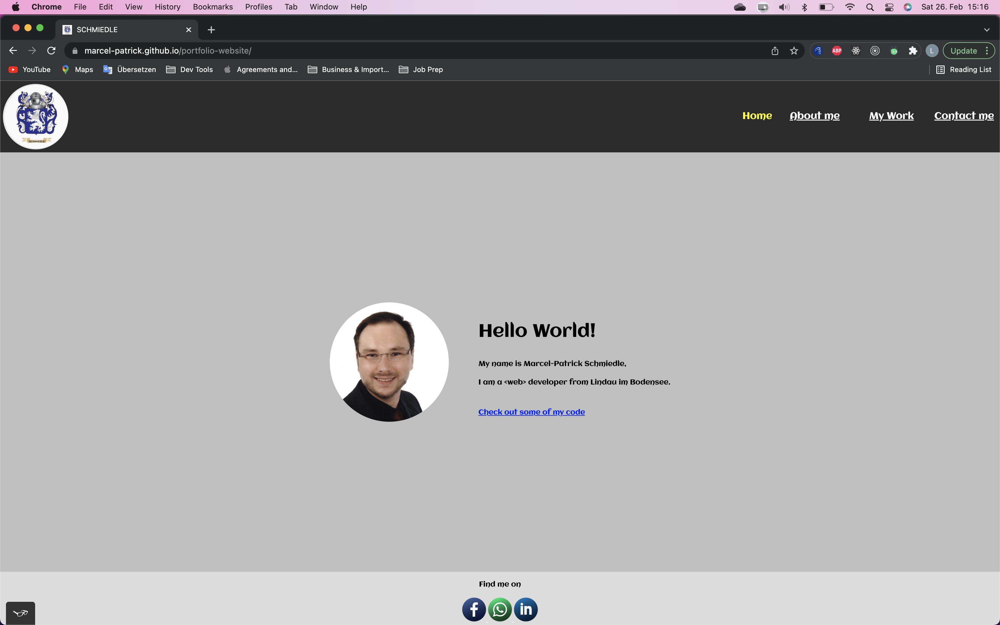
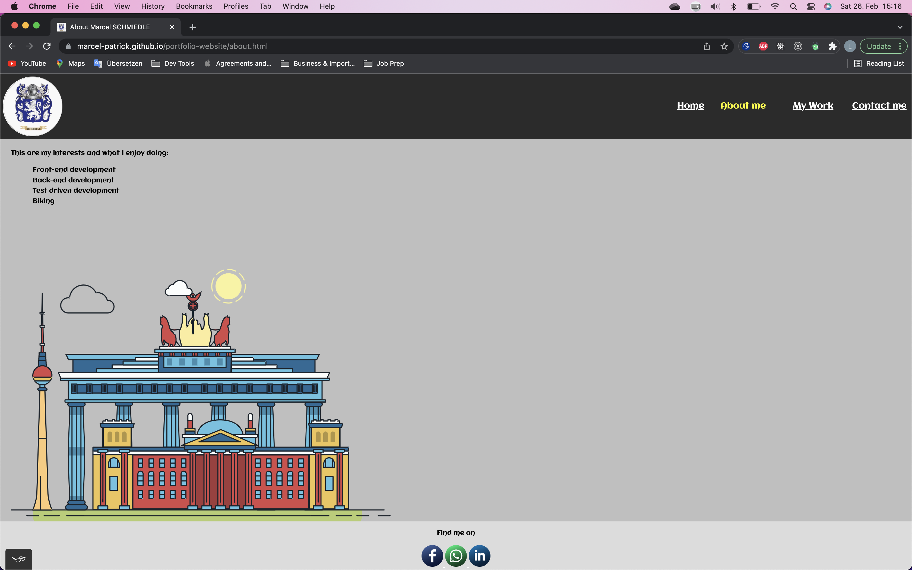
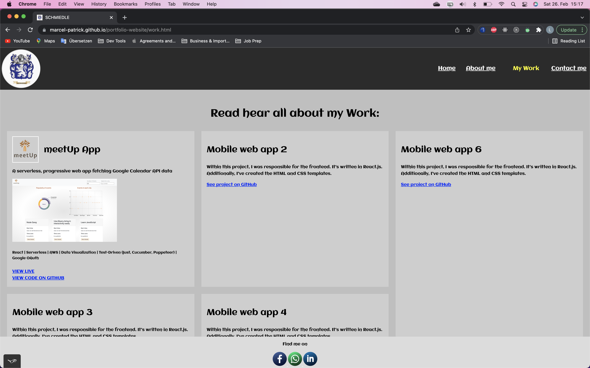
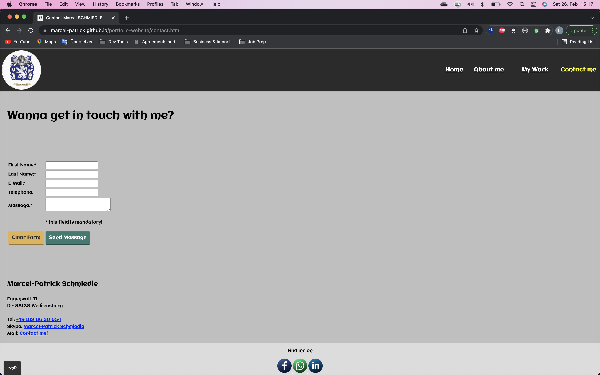

# portfolio-website

## Achievement 1:

**Intro to Frontend Development**

### Project 1:

**Responsive Portfolio Website**

---

## Objective:

**To build a responsive website using HTML and CSS that will showcase your professional portfolio, which will include the projects you’ll build throughout your Full-Stack Web Development Program, to your professional network and potential employers.**

## Context:

For a professional web developer, it’s essential to have a designated place to present his work and demonstrate relevant skills such as problem-solving or practical knowledge in programming languages. Since chances are high on the quality of the website itself, it’s essential for it to be of high code quality. 

In addition, as responsive design has become a basic requirement for nearly all web-based projects, it’s important that this website is responsive and run smoothly on all devices. 

The goal of this project is to create a working website, complete with subpages, that features key information about yourself as a web developer, relevant work examples, as well as contact details. 

This website also shall privide the option to include the projects are be build up throughout this Full-Stack Web Development Program. That keept in mind while planning the HTML structure of this website. 

In the following sections are some more information on the development criteria and requirements for this site: 

---

# Features & Requirements

## User Goals:

Your users should be able to view your professional portfolio website and navigate between web pages on both mobile and desktop. 

## Key Features:

- A homepage with a short introduction and link(s) to work examples
- An about page with key information about yourself as an individual, your relevant skills, and the tools or programming language(s) you use
- A section with work examples —> either as part of your homepage (e.g., in a grid) or on a separate work page
- A contact section —> either as a section on each page (e.g., in the footer) or in a separate contact page

## Technical Requirements:

- The website must consist of at least 3 interconnected HTML pages.
- The website must use one external CSS-file in which all styles are defined.
- The website must use either CSS variables or a CSS preprocessor.
- You shall not include any external CSS libraries that you didn’t write yourself.
- The website’s code must be hosted in a Git repository on GitHub.
- The website can be deployed on a server. (While we strongly recommend doing so, this isn’t mandatory, and you can remove your website from the free test server after you’ve completed the project.)
- All your code must be valid.
  - Your HTML files must pass validation on the Markup Validation Service.
  - All colors used need to pass the AA Accessibility Guidelines.
- The website must work on the latest Chrome, Firefox, Safari, Edge, and Opera browser versions as well as on IE11.
- The website must work on all screen sizes (including mobile and tablet) between 1920px and 320px in width.
- The website must work with keyboard, mouse, and touch inputs.

---

## Homepage:

[Link to Homepage](https://marcel-patrick.github.io/portfolio-website/index.html)

## About page:

[Link to About me page](https://marcel-patrick.github.io/portfolio-website/about.html)

## Work page:

[Link to My Work page](https://marcel-patrick.github.io/portfolio-website/work.html)

## Contact page:

[Link to Contact me page](https://marcel-patrick.github.io/portfolio-website/contact.html)

